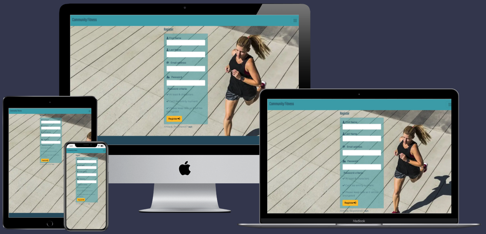
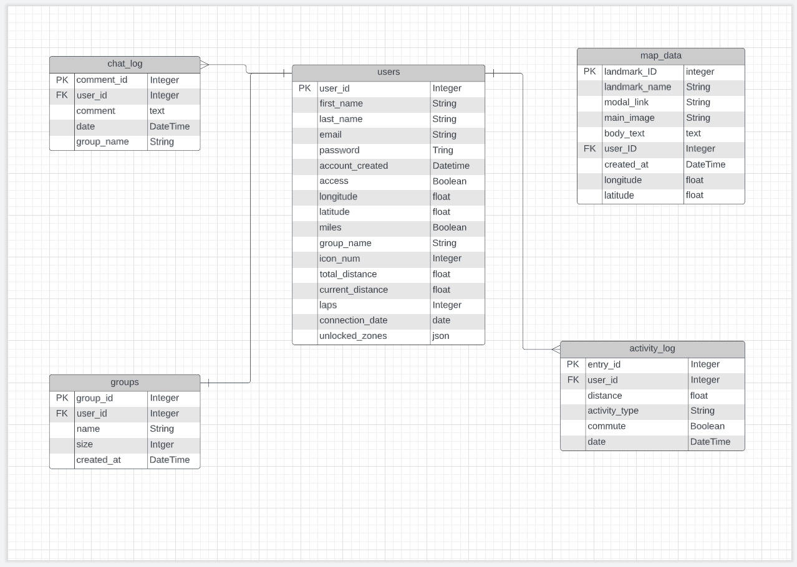
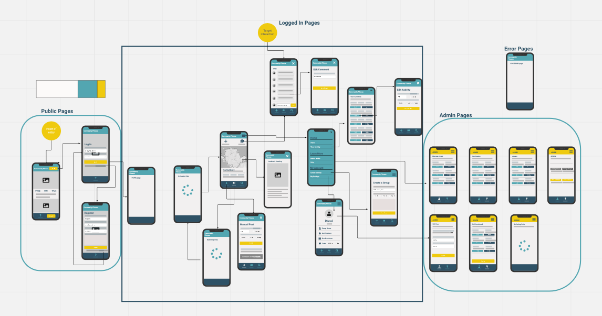
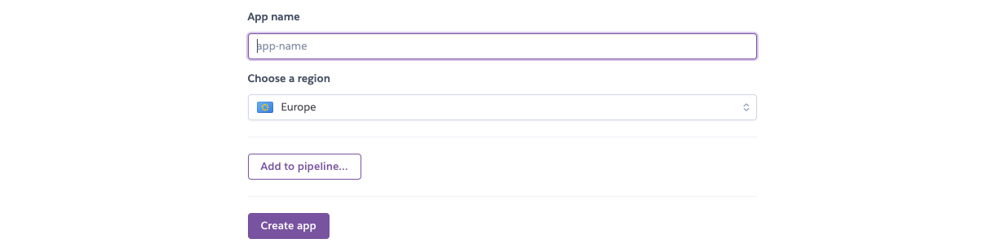

<h1 align="center">Social Fitness Motivation Website</h1>

<span id="breaktasty"></span>




You can visit the deployed website [here](https://baz-project-three.herokuapp.com/).


## Table of Contents

- <a href="#ux">1. User experience (UX)</a>
  - <a href="#ux-goals">1.1. Project goals</a>
  - <a href="#ux-stories">1.2 User stories</a>
  - <a href="#ux-design">1.3 Design</a>
  - <a href="#ux-architecture">1.4 Information architecture</a>
  - <a href="#ux-mockup">1.5 Mockup designs</a>
- <a href="#features">2. Features</a>
  - <a href="#features-existing">2.1 Existing features</a>
  - <a href="#features-future">2.2 Features left to implement in the future</a>
- <a href="#technologies">3. Technologies used</a>
- <a href="#testing">4. Testing</a>
- <a href="#deployment">5. Deployment</a>
  - <a href="#clone-project">5.1. Make a local clone</a>
  - <a href="#forking-repo">5.2 Forking the GitHub Repository</a>
  - <a href="#heroku-deployment">5.3 Deploy to Heroku</a>
- <a href="#credits">6. Credits</a>
- <a href="#acknowledgements">7. Acknowledgements</a>

---

<span id="ux"></span>

<h1>1. User experience (UX)</h1>

<span id="ux-goals"></span>

### 1.1 Project goals 

- Making a full-stack site that allows users to manage a common dataset about a particular domain. 
- Making a full-stack site that uses HTML, CSS, JavaScript, Python+Flask and Postgres DB.

-  This site allows users to log there fitness activity and see there progress dipicted in an there icon moving around a map. 
-  They share this view with other group members so that they can see how they compare and can interect and motivate each other.

- Creating a website that is simple to understand and easy to navigate.
- The users of the website can make use of CRUD (create, read, update and delete) for the data. 

<span id="ux-stories"></span>


### 1.2 User stories 

**First-time visitor goals:**
1. As a first time visitor, I want to be able to visit the website on any device. 
2. As a first time visitor, I want to be able to navigate easily through the website, so I can find everything easily. 
3. As a first time visitor, I want to be able to easily understand what the application is about.
4. As a first time visitor, I want to have it simply explained how it works before committing to registering.
5. As a first time visitor, I want the registration & login process to be intuative.

**Site member goals:** 

All the goals of first-time visitors also apply for site members. There are additional user stories to the site members because they have more access to the website. See the additional user stories below. 

1. As a site member, I want to login to my profile, so only I have control of the data I share. 
2. As a site member, I want to record my sporting activities easily and quickly. 
3. As a site member, I want to edit my activities, so I can update information if I have made an error.
4. As a site member, I want to delete my activities, so I have complete control over what I choose to share. 
5. As a site member, I want to see my fellow group member comments.
6. As a site member, I want to post my own comments.
7. As a site member, I want to edit my comments, so I can update information if I have made an error.
8. As a site member, I want to delete my comments, so I have complete control over what I choose to share.
9. As a site member, I want to create my own group name.
10. As a site member, I want to be able to edit my account details.
11. As a site member, I want to logout from my profile, so I can ensure nobody else can change my data. 
12. As a site member, I want to be able delete my account should I wish at any time.

**Admin goals:**

All the goals of the first time visitors and site members also apply for the admin. The admin has additional user stories to manage the categories of the recipes. 
1. As an admin, I want to add landmarks
2. As an admin, I want to edit landmarks, so I can easily correct any errors. 
3. As an admin, I want to delete landmarks, should they are no become longer relevant. 
4. As an admin, I want to be able edit users, so I can change there access level where appropirate. 
5. As an admin, I want to be able to delete users, should it be required. 
6. As an admin, I want to be able edit group name, should there be a need. 
7. As an admin, I want to be able to delete group names, should it be required. 

<span id="ux-design"></span>


<span id="ux-design"></span>

### 1.3 Design 

**Colour scheme:**

The colour scheme was chosen to give a calm feel. I have used the 60-30-10 rule for the balance of colour in the design. 60% being the off white, 30% being the blues & 10% being the yellow denoting call to action where applicable.

These colours were used throughout all the pages in such a way as to ensure adequate contrast and good user experience.

The pallet created using [Coolors.co](https://coolors.co/)
<details><summary>See colour pallet</summary>

</details>

**Fonts:**

Google Fonts were implemented on the website. Firstly for the body text and buttons Montserrat font was the choice, Montserrat is a clean font used frequently in programming, so it is both attractive and appropriate. Secondly for the headings, navigation text and to display the results Teko is the choice, this is a slim font allowing for more content to be displayed in a small area. Both fonts have Sans Serif as the fallback font in case for any reason the font isn't being imported into the site correctly.

**Icons:**

In this project, icons are used that are provided by Font Awesome. The Icons that are used have functional purposes such as the hamburger menu and social media icons.


**Images:**
In this site there is a main background image for the running woman to convay they site is for acctive people. On the landing page I made a graphic to illustrate that the site works on multiple devices. Then the site admin is able to include images of the landmark data that appear in the modal from the map view.

- #### Defensive design 

- The user is not able to break the site by clicking on buttons. 
- The signup form: 
- The first and last names has to be between 2-15 characters and only must contain letters and numbers. 
- The password has to be between 5-15 characters and must contain at least one number, and one uppercase and lowercase letter.
- The email must be in the following order: characters followed by a @ symbol, followed by more characters and then a “.”.
- A nothing can't be deleted by just one click. If someone clicks on the delete button, there wil be a pop up with a confirmation if someone is sure to delete the item.

### Wireframes

The wireframes for this site were produced in [Balsamiq](https://balsamiq.com/). Wire frames were created for Desktop, Tablet.

Wireframe - [View](WIREFRAMES.md)


<span id="ux-architecture"></span>

### 1.4 Information architecture

#### Database

- The backend consists of Python built with the Flask framework with a database of a Postgres for the deployed Heroku version(production)
- Five database models contain all fields stored in the database and mimics the structure of what is actually stored in the Postgres database

<details><summary>See Entity Relationship Diagram</summary>

</details>

### Structure

A key aspect of the design was to maitain a balance between clean design and intuative navigation for all devices sizes.

- The website consists of the following sections:
  - Landing page with explanation of what this site is about for first time visitors.
  - Login page for returning user to log in.
  - Register page allowing a new user to sign up.
  - Profile which provides a summary of their settings and an option to delete the account.
  - Map link and user json pages gathers data and provide a loading symbol while this is done.
  - Set up checks if its a new user, prompts them to log their first activity and populates the db with a record of the 
    user progress.
  - landmark json loads after when landmarks are created or edited to update the json file for the map data.
  - Admins pages to edit & delete groups, landmarks & users.
  - Chat page for group members to chat among them selfs based of the group they are in.
  - Regoster a group allowing users to create there own groups.
  - Setting allowing users to change there email and icon.
  - Map view showing where each fellow group member has got to on ther journey so far. Also users can click a
    landmark flag to unveil details ablit the landmark only when they have reached that point. Also the can click on other users icons to see their stats.
  - Logout allowing users to leave the site.
  - 404 error page.


The following models were created to represent the database model structure for the website:

##### Users Model
- The User model contains information about the user. 

##### Chat Log Model
- The chat model contains every comment made on the site.
- The data is retrived by filtering only comments from fellow groups members of the logged in user.

##### Groups Model
- The groups model contains the name and size of each group.
- Users can only be part of a group name in this table.
- Group ids can not be deleted but name and size can be edited by admin.

##### Activity Log Model
- The Activity Log model contains all instances of activity posted by users.
- Users can Edit & Delete only there own activities.
- Leadersboards and made from the sum values of activities fittered by the group they are part of.

##### Map Data Model
- The Map Data model contains landmark information.
- Map data can be created, Edited & deleted only by admin users.
- Changes are only seen once the landmark json file is updated by admin.


<span id="ux-mockup"></span>

### 1.5 Mockup designs

### Mockup Design

For the Mobile I used [Miro](https://miro.com/). This allowed me to create a mock-up design and give more detailed of each page and show how they are connected so that user flow could be easily understood.

<details><summary>See Miro Board</summary>

</details>

##### Back to [top](#table-of-contents)

<span id="features"></span>

<h1>2. Features</h1>

<span id="features-existing"></span>

### 2.1 Existing features 

#### 1. Design 
- An attractive and simple layout with consistency.
- Simple navigation throughout the website by using the navigation bar. 
- Showing progress of the users with icons on the map.

#### 2. General 
- The landing page explains how the application works.
- There are links to the social media platforms at the top and bottom of the website. 

#### 3. Activities
- Activities can be created, read, updated and deleted (CRUD) by the users. 
- People can search the leaderbaords to see how the compare with the search function of the leaderboard page. 
- Users have access to their profile, and can view all their activities. 

#### 4. Comments
- Comments can be created, read, updated and deleted (CRUD) by the users. 
- Comments are presented in date order.
- Comments are only shared between fellow group members. 
- Users can only edit & delete there own comments.

#### 5. Signup, login and logout 
- People can create a new account on the web application. 
- People can login with their existing accounts. 
- People can easily log out.
- If a person creates a new account, logs in or logs out, a flashed message will appear with the action the person has done. 

<span id="features-future"></span>

### 2.2 Features left to implement in the future 

  - Allow users to upload their own icon.
  - Allow admins to upload images of landmarks.
  - Allow admins to upload video drone footage of these landmarks.
  - Notification to users when they reach certain distances.
  - Stava API integration so that users activity can be posted automatically.


##### Back to [top](#table-of-contents)

<span id="technologies"></span>

<h1>3. Technologies Used</h1>


### Languages & Frameworks

- HTML
- CSS
- Javascript
- Python 3
- Flask


### Libraries & Tools

- [Am I Responsive](http://ami.responsivedesign.is/) was used to create the multi-device mock-up at the top of this README.md file
- [Balsamiq](https://balsamiq.com/) to create the projects wireframes
- [Bootstrap v5.0.2](https://getbootstrap.com/). This project uses the Bootstrap library for UI components (Buttons, Card, Footer, Modal, Pagination, Navbar)
- [Lucidchart.com](https://lucidchart.com) used for the entity relationship diagram.
- [Chrome dev tools](https://developers.google.com/web/tools/chrome-devtools/) was used for debugging of the code and checking site for responsiveness
- [Font Awesome](https://fontawesome.com/) - Icons from Font Awesome were used throughout the site
- [Git](https://git-scm.com/) was used for version control within VSCode to push the code to GitHub
- [GitHub](https://github.com/) was used as a remote repository to store project code
- [Google Fonts](https://fonts.google.com/)
- [Heroku Platform](https://id.heroku.com/login) was used to deploy the project into live environment

- [Postgres](https://www.postgresql.org/) – deployed project on Heroku uses a Postres database

- [Visual Studio Code (VSCode)](https://code.visualstudio.com/) - code editor used to write this project
- Validation:
  - [WC3 Validator](https://validator.w3.org/) was used to validate the html in the project
  - [Jigsaw W3 Validator](https://jigsaw.w3.org/css-validator/) to validate the css in the project
  - [JSlint](https://jslint.com/) for JavaScript quality
  - [PEP8](http://pep8online.com/) to check code against Python conventions
  - [Lighthouse](https://developers.google.com/web/tools/lighthouse/) for performance, accessibility, progressive web apps, SEO analysis of the project code
  

##### Back to [top](#table-of-contents)


<span id="testing"></span>

<h1>4. Testing</h1>

The testing process can be found [here](TESTING.md).

<span id="deployment"></span>

<h1>5. Deployment</h1>

#### Requirements 
- Python3 
- Github account 
- Heroku account


<span id="clone-project"></span>

### 5.1 Clone the project 

1. Go to the GitHub repository 
2. Locate the Code button above the list of files and click it
3. Highlight the "HTTPS" button to clone with HTTPS and copy the link
4. Open commandline interface on your computer
5. Change the current working directory to the one where you want the cloned directory
6. Type git clone and paste the URL from the clipboard 
  ```
  $ git clone https://github.com/BarryBeics/Project-Three
  ```
7. Press Enter to create your local clone


<span id="forking-repo"></span>

### 5.2 Forking the GitHub Repository

Go to the GitHub repository
Click on Fork button in top right corner
You will then have a copy of the repository in your own GitHub account.

<span id="heroku-deployment"></span>

### 5.3 Heroku Deployment  

1. Set up local workspace for Heroku 
    - In terminal window of your IDE type: **pip3 freeze -- local > requirements.txt.** (The file is needed for Heroku to know which filed to install.)
    - In termial window of your IDE type: **python app.py > Procfile** (The file is needed for Heroku to know which file is needed as entry point.)
        
2. Push the requirements.txt and Procfile to repository. 
     ```
    $ git add requirements.txt
    $ git commit -m "Add requirements.txt"

    $ git add Procfile 
    $ git commit -m "Add Procfile"
    ```

2. Set up Heroku: create or login to your Heroku account and create a new app and select your region. 

<details><summary>See new app screen shot</summary>

</details>

3. Under 'Resources' you can see the Add-ons window type "Heroku Postgres". 
The a pop up window prompts you to select a plan name. 
Hobby Dev - Free works for this project. Now click "Submit Order Form"

<details><summary>You should now see:</summary>

</details>

4. Under 'Setting' you will see Buildpacks. Click on the purple 'Add buildpack" button then type heroku/python.

  <details><summary>You should now see</summary>
  
  </details>

5. Next click on Reveal 'Config Vars' button.
<details><summary>These are the details you need to add</summary>

</details>

6. Deployment via 'Github'
    - Click on the **Connect to GitHub** section in the deploy tab in Heroku. 
        - Search your repository to connect with it.
        - When your repository appears click on **connect** to connect your repository with the Heroku. 
   
        
5. Automatic deployment: Go to the deploy tab in Heroku and scroll down to **Aotmatic deployments**. Click on **Enable Automatic Deploys**. By **Manual deploy** click on **Deploy Branch**.

Heroku will receive the code from Github and host the app using the required packages. 
Click on **Open app** in the right corner of your Heroku account. The app wil open and the live link is available from the address bar. 

##### Back to [top](#table-of-contents)

<span id="credits"></span>

<h1>6. Credits</h1>

### Liabary 

- Top render the map and the icons I made use of the [leaflet.js](https://leafletjs.com/)

#### Images
- Picture of the running woman taken from [here](https://pixabay.com/photos/running-woman-fitness-runner-6252827/)

#### Code

- [Flask Migrate - How To Migrate Database With Flask - Flask Fridays #11](https://www.youtube.com/watch?v=ca-Vj6kwK7M)
- [W3Schools: HTML Input Pattern Attribute](https://www.w3schools.com/tags/att_input_pattern.asp)
- [W3Schools: HTML Input Attributes](https://www.w3schools.com/html/html_form_attributes.asp)

<span id="acknowledgements"></span>

<h1>7. Acknowledgements</h1>

Thanks to the following people and organizations who helped me with this project:  
- The support and guidance of my mentor Precious Ijege. 
- The lessons and knowledge of [Code Institute.](https://codeinstitute.net/)


##### Back to [top](#table-of-contents)
