## Testing
<hr>

## Testing Index

- <a href="#code">1. Code validators</a>
- <a href="#responsive">2. Responsiveness</a>
- <a href="#browser">3. Browser compability</a>
- <a href="#test-user-stories">4. Testing user stories</a>
- <a href="#defensive">5. Defensive design</a>
- <a href="#bugs">6. Bugs</a>

## Admin Login details
email: admin@codeinstitute.com
password: admin

for non admin users simply create an account using the register page
<span id="code"></span>


## Code Validation
<hr>

The W3C Markup Validation Service was used to validate the HTML of the website.
### - - - - Public Pages

<details><summary>Landing Page</summary>
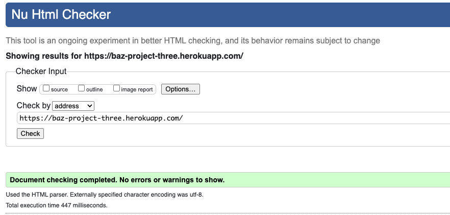
</details>

<details><summary>Login Page</summary>

</details>

<details><summary>Register Page</summary>

</details>

### - - - - Logged In Pages

<details><summary>Chat Page</summary>
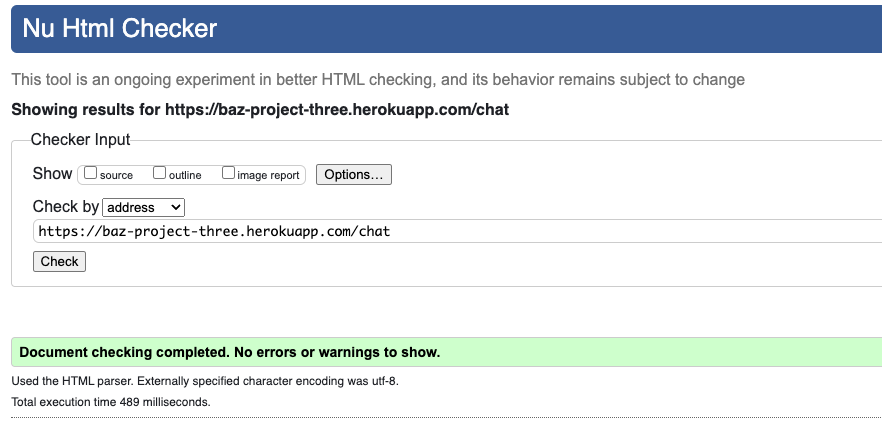
</details>

<details><summary>Edit Activity Page</summary>

</details>

<details><summary>Edit Comment Page</summary>
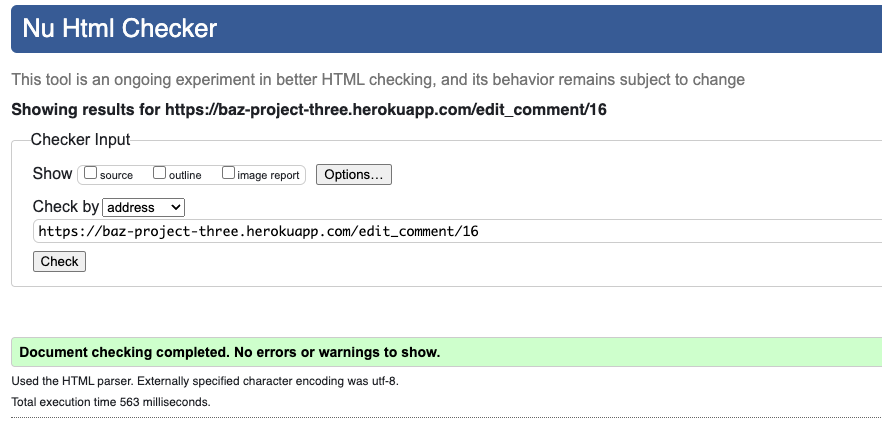
</details>

<details><summary>Map Page</summary>

</details>

<details><summary>Post Activity Page</summary>
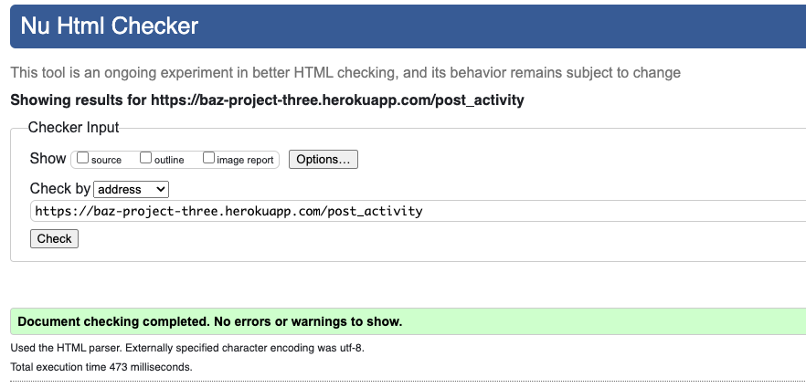
</details>

<details><summary>Profile Page</summary>

</details>

<details><summary>Register Group Page</summary>

</details>

<details><summary>Settings Page</summary>

</details>

<details><summary>View Activity Page</summary>
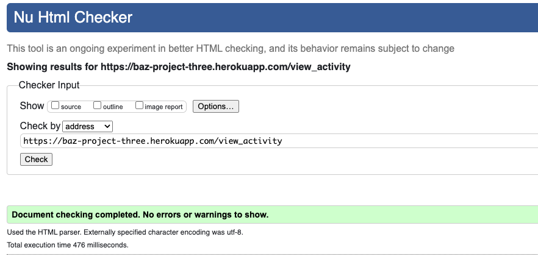
</details>

### - - - - Loading Pages

<details><summary>Landmark JSON Page</summary>
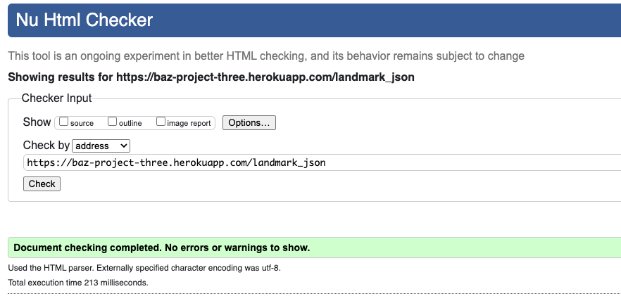
</details>

<details><summary>Map Link Page</summary>

</details>

<details><summary>Set Up JSON Page</summary>
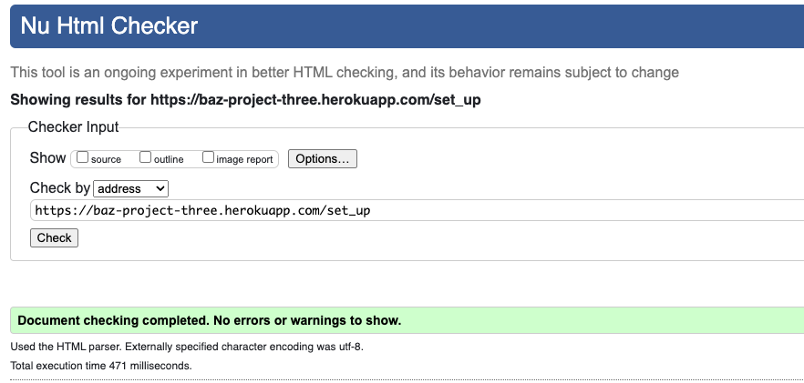
</details>

<details><summary>User JSON Page</summary>
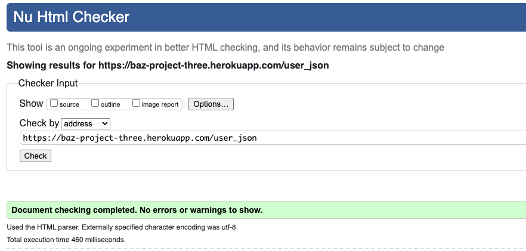
</details>

### - - - - Error Handling Pages

<details><summary>403, 404, 500 Page</summary>
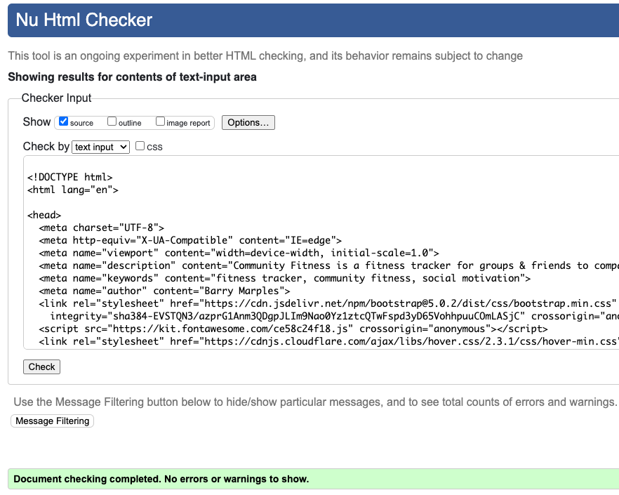
</details>

### - - - - Admin Pages

<details><summary>Add Landmark Page</summary>

</details>

<details><summary>Admin Page</summary>
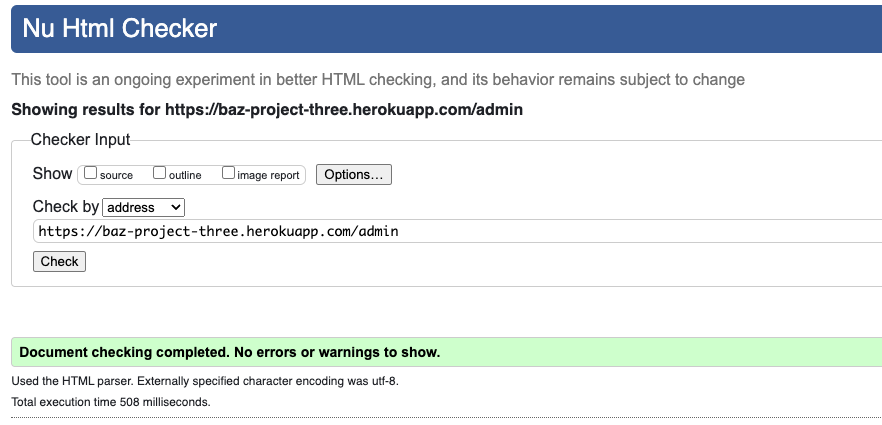
</details>

<details><summary>Edit Group Page</summary>

</details>

<details><summary>Edit Landmark Page</summary>

</details>

<details><summary>Edit User Page</summary>

</details>

<details><summary>Groups Page</summary>
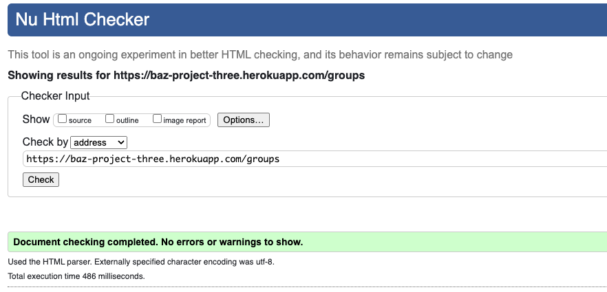
</details>

<details><summary>Landmarks Page</summary>
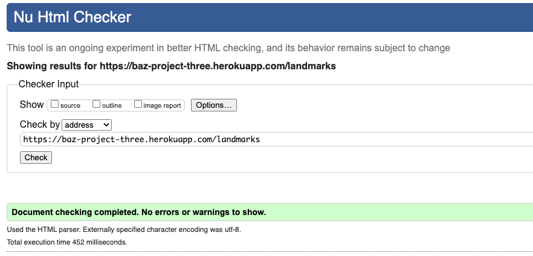
</details>

<details><summary>Users Page</summary>
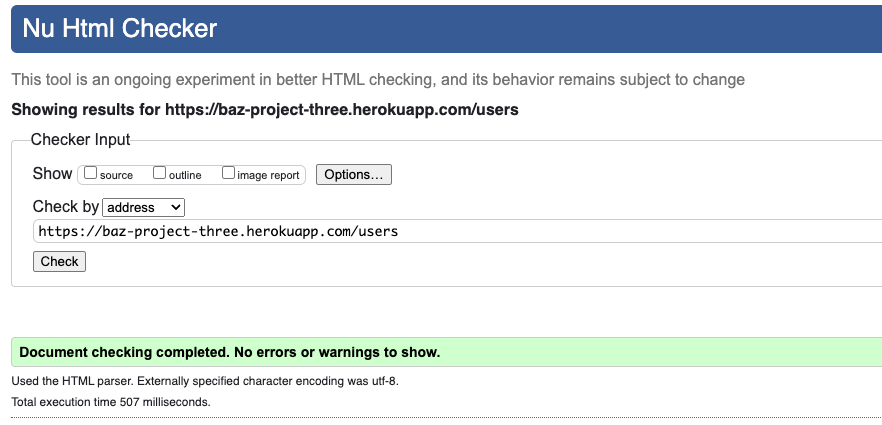
</details>

## CSS Validation
<hr>

The W3C Jigsaw CSS Validation Service was used to validate the CSS of the website. When validating all website, it passes with no errors.

<details><summary>style.css</summary>
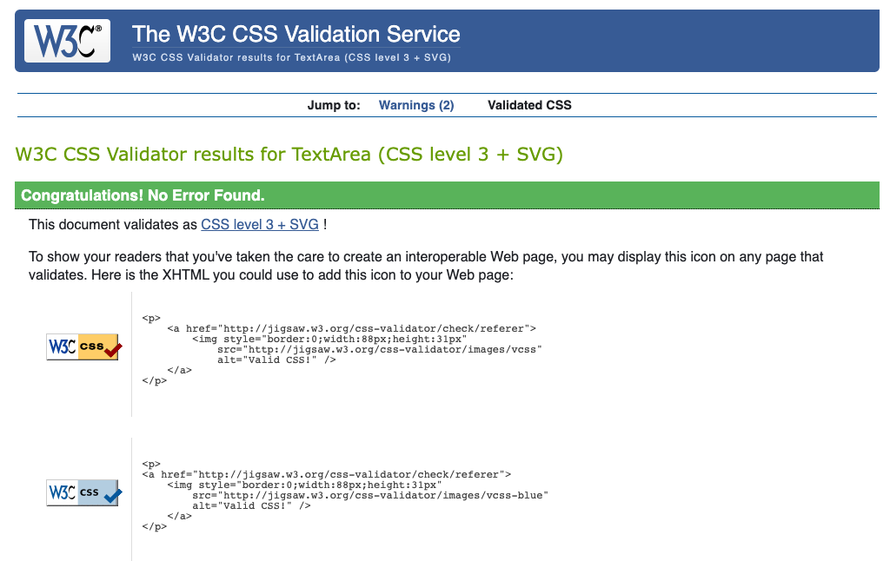
</details>

## JavaScript Validation
<hr>

JSLint JS Validation Service was used to validate the Javascript files. No errors were found.
There are 8 warnings but any atempt to shorted the 80 character breaks the code.

<details><summary>map_build.js</summary>
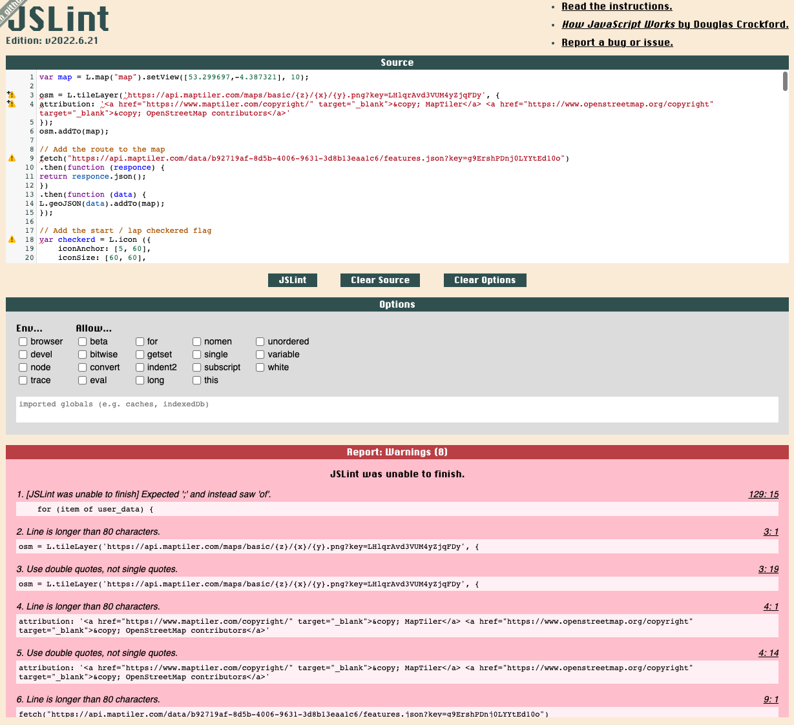
</details>

## PEP8 Validation
<hr>

PEP8 Validation Service was used to check the code for PEP8 requirements. All the code passes with no errors and no warnings to show.

<details><summary>init.py</summary>
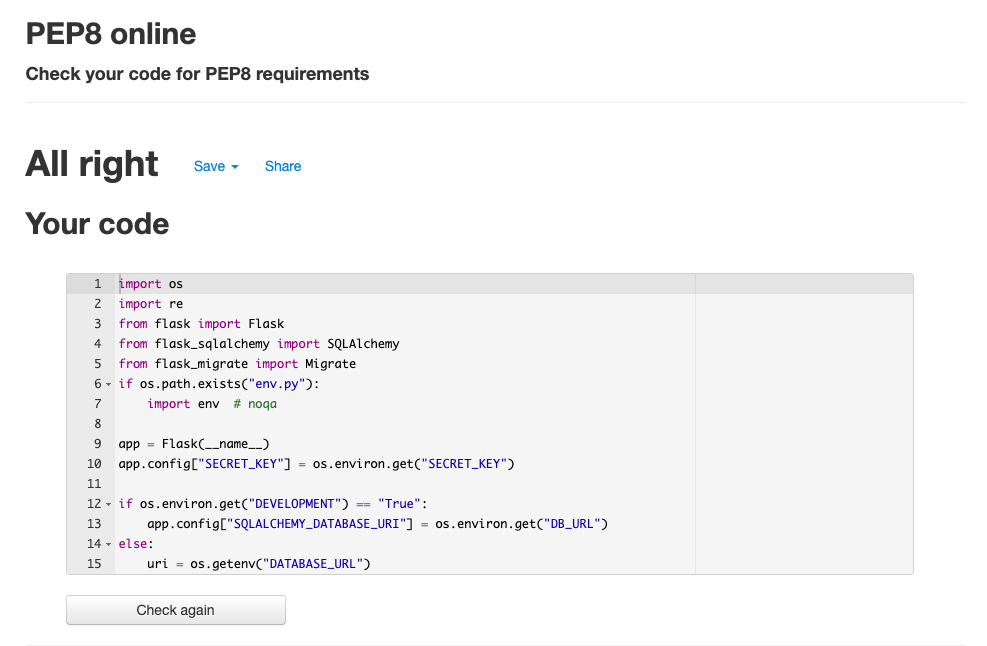
</details>

<details><summary>models.py</summary>
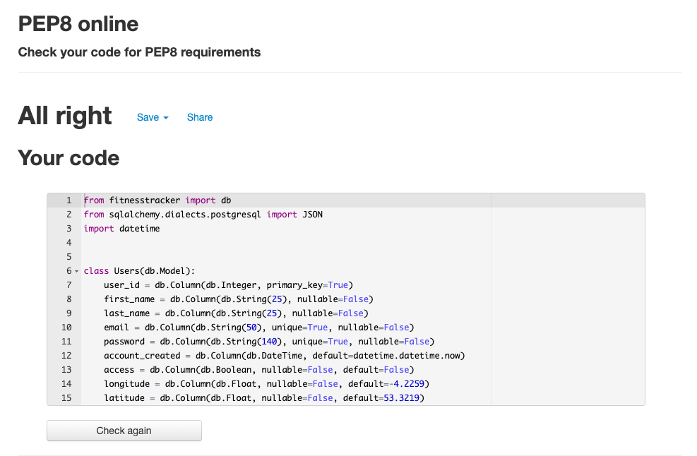
</details>

<details><summary>routes.py</summary>
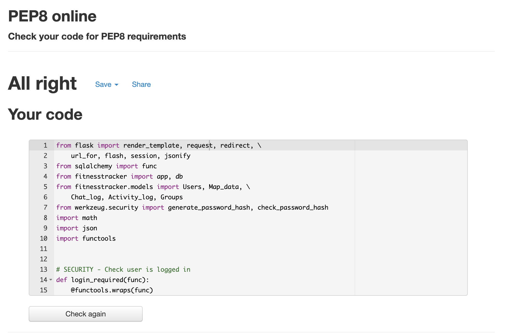
</details>

<span id="responsive"></span>

## 2. Responsiveness
---
 
The responsive design tests were carried out manually whilst building the site with [Google Chrome DevTools](https://developer.chrome.com/docs/devtools/)
 

<span id="browser"></span>

## Browser Compatibility

This site was tested on the following browsers with no visible issues for the user. Google Chrome, Safari and Mozilla Firefox. Appearance, functionality and responsiveness were consistent throughout for a range of device sizes and browsers.


<span id="test-user-stories"></span>

## Testing user stories

**First-time visitor goals:**
1. As a first time visitor, I want to be able to visit the website on any device. 
    - The first time visitor can visite the website on a computer, laptop, tablet and phone.

2. As a first time visitor, I want to be able to navigate easily through the website, so I can find everything easily. 
    - The first time visitor can navigate through the website using the hamburger menu in the header and footer icon.
      Where nessarey there are internal back arrows to assist with the flow of the site navigation.

3. As a first time visitor, I want to be able to easily understand what the application is about.
    - The landing page summerises what the site is about in a few short sentences. Also the runner in the background
      image is there to give the site an sporty feel which the user can relate to.

4. As a first time visitor, I want to have it simply explained how it works before committing to registering.
    - There is a 4 point how it works on the landing page with icons to quickly and easily express whats the site is about before needing to log in or register.

5. As a first time visitor, I want the registration & login process to be intuative.
    - The registration & login screens are clean and minimual with only essential supporting text.


**Site member goals:** 

All the goals of first-time visitors also apply for site members. There are additional user stories to the site members because they have more access to the website. See the additional user stories below. 

1. As a site member, I want to login to my profile, so only I have control of the data I share. 
    - The employs a secure login feature with the ability to restric all none logged in users from shared data.

2. As a site member, I want to record my sporting activities easily and quickly. 
    - The is a clean minalmal form for loggin activity easily and quickly.

3. As a site member, I want to edit my activities, so I can update information if I have made an error.
    - The site offers the ability to view all activities and edit them with the same clean minalmlist form.

4. As a site member, I want to delete my activities, so I have complete control over what I choose to share. 
    - From the list activities page the user can view all there activities and choose to delete any of them, they 
      will be prompted to confirm they are sure so no data is acidently deleted.

5. As a site member, I want to see my fellow group member comments.
    - The chat page only loads the comments of fellow group members making it easy to see what has been said in 
      your group.

6. As a site member, I want to post my own comments.
    - At the bottom of the comments feed the users are provided with a clean minalmalist form for posting there 
      own comments.

7. As a site member, I want to edit my comments, so I can update information if I have made an error.
    - Next to the users comments is an edit button so they can make any changes they require to the comment.

8. As a site member, I want to delete my comments, so I have complete control over what I choose to share.
    - Also along side the edit button the user can delete there own comments only.

9. As a site member, I want to create my own group name.
    - Users are provided the option to create there own unique group name from the link in the main navigation.

10. As a site member, I want to be able to edit my account details.
    - The settings page gives the user the option to change there email, user icon and which group they are part of.

11. As a site member, I want to logout from my profile, so I can ensure nobody else can change my data.
    - There is a log out button which ends the session to ensure nobody else can access the users data.

12. As a site member, I want to be able delete my account should I wish at any time.
    - Should the user want to delete there account this can be done from the delete button on the bottom of the profile 
    page, they will be prompted to confirm they are sure so as to avaoid mistakenly deleting theit account.

**Admin goals:**

All the goals of the first time visitors and site members also apply for the admin. The admin has additional user stories to manage the categories of the recipes. 
1. As an admin, I want to add landmarks
    - Admin users can add all the landmark details using the add landmarks pags.

2. As an admin, I want to edit landmarks, so I can easily correct any errors. 
    - The admin page provides a link to a list of all landmark from which there is a edit button for making changes
      to any of the landmark data.

3. As an admin, I want to delete landmarks, should they are no become longer relevant. 
    - Also from the list of landmarks there is the option to delete a landmark and in keeping with the site format
      the admin user is prompted to confirm they know that deleting the data is non reversable.

4. As an admin, I want to be able edit users, so I can change there access level where appropirate. 
    - The admin user is provided with a list of all users and a like to the edit user form where they can make a 
      user and admin and change therr longitue and latitude coordinates.

5. As an admin, I want to be able to delete users, should it be required. 
    - The admin user from this list can choose to delete any user simply but clicking the delete button, they will 
      be prompted to confrim this action so no users are deleted by accident.

6. As an admin, I want to be able edit group name, should there be a need. 
    - The admin user is able to manage the groups created by users, they can edit both the size and name of the group.

7. As an admin, I want to be able to delete group names, should it be required. 
    - There is the option for the admin user to delete any of the groups, they will be prompted to confirm this action.

<span id="defensive"></span>

## Defensive design

1. The user is not able to break the site by clicking on buttons. 

**Answer 1:** All buttons on the website work. The buttons on the website consist buttons that lead to other pages or submit buttons to add, edit or delete something from the database.

2. The signup form: 
    - 2.1 The first & last name fields have to be between 2-15 characters and only must contain letters and numbers.
    - 2.2 The password has to be between 5-15 characters, only must contain letters and numbers and Can't be 
     entrily numeric.
    - 2.3 The email field resetrics a none email format from being submitted.
        
3. The add and edit content forms:
    - 3.1 The name feilds have restricted to between set character ranges and only must contain letters and/or numbers
      where required.
        - The validation of a feild when it needs to be unique is done using python to query the database to check
          to see if they value allready exists.
    
4. Both register ane user edit email fields required that the email must be in the following order: characters followed by a @ symbol, followed by more characters and then a “.”.

**Answer 2 + 3 + 4:** 
The validation of all input fields is done with front end validation and by using the validate functionality of html5. 

- The input fields between a number of characters. This is done minlength, maxlength and the pattern attribute. 
- The input fields have a number of criteria. These criterias where set by the pattern attribute.
- The html type attribute is used to set for example numbers, text or email.
- The required functionality is used to make the input fields required. 

See below the input fields for an example of front end validation:
    
    ```
     <!-- last name -->
    <div class="mb-3">
    <i class="fa-solid fa-user" aria-hidden="true"></i>
    <label for="last_name">Last Name</label>
    <input type="text" name="last_name" minlength="2" maxlength="15"
    pattern="^[a-zA-Z0-9]{2,15}$" class="form-control" id="last_name"
    aria-describedby="last_name" required>
    </div>

    <!-- email -->
    <div class="mb-3">
    <i class="fa-solid fa-at" aria-hidden="true"></i>
    <label for="email" class="form-label">Email address</label>
    <input id="email" name="email" type="email" class="form-control"
    pattern="[a-z0-9._%+-]+@[a-z0-9.-]+\.[a-z]{2,}$" required>
    </div>

    <!-- password -->
    <div class="mb-3">
    <i class="fa-solid fa-user-lock" aria-hidden="true"></i>
    <label for="password" class="form-label">Password</label>
    <input type="password" minlength="5" maxlength="15" pattern="^[a-zA-Z0-9]{5,15}$"
      name="password" class="form-control" id="password" required>
    <label for="password" class="form-label">Password criteria:</label>
    <p><i class="fa-solid fa-check"></i> Can't be entrily numeric</p>
    <p><i class="fa-solid fa-check"></i> Please keep safe as it will be encrypted</p>
    </div>
    ``` 

5. A user, group, comment, landmark, & activity log can't be deleted by just one click. If someone clicks on the delete button, there wil be a pop up with a confirmation if someone is sure to delete the record.

**Answer 5:** If someone clicks on the delete button, a modal (from bootstrap) will pop up with the text: Are you sure you want to delete said item. If the user clicks again on delete the user, group, comment, landmark, & activity will be deleted from the database.


<span id="bugs"></span>

## Bugs

1. When testing the forms I discoved the Edit group form failed in one permutation, that was when the group size was changed but the group name was not I got the folloing error.
<details><summary>Edit Group</summary>
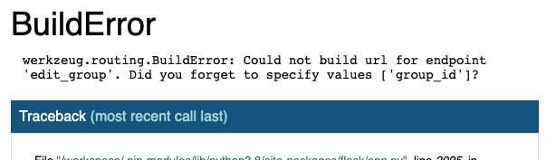
</details>

It was fixed by adding 
```
return redirect(url_for("edit_group", group_id=group_id))
```

But this then threw up another problem in that is didn't handle nothing being changed.

this was fixed with the following code which checked if the value in groupo size remained the same.

```
# Check if the group size has been change
    size_change = Groups.query.filter(
        Groups.size == request.form.get("size")).all()

    if existing_group:
        if request.method == "POST":
            if size_change:
                flash("No change!")
                return redirect(url_for("edit_group", group_id=group_id))

            group.size = request.form.get("size")
            db.session.commit()
            flash("Group size updated!")            
            return redirect(url_for("edit_group", group_id=group_id))
```


2. When chekcing over naming conventions I decided to change my folder that hold the JSON file from
JSON to json I updated my routes.py folder and when checking the site in the browser all was fine.
Later I discovered the map markers where all missing from the map. 

It turns out the reason it was file was the browser had cached the data for the map and once update 
the markers disapeared.

I discovered by adding console logs to my map_build.js file that I had over looked the 2 references 
in the file which still used the uppercase JSON.

3. When building the project I needed to make changes to my schema but had trouble updating the database
both locally and on heroku. To resolve this issue I had to install Flask Migrate to which I followed thie video 
[Flask Migrate - How To Migrate Database With Flask - Flask Fridays #11](https://www.youtube.com/watch?v=ca-Vj6kwK7M)