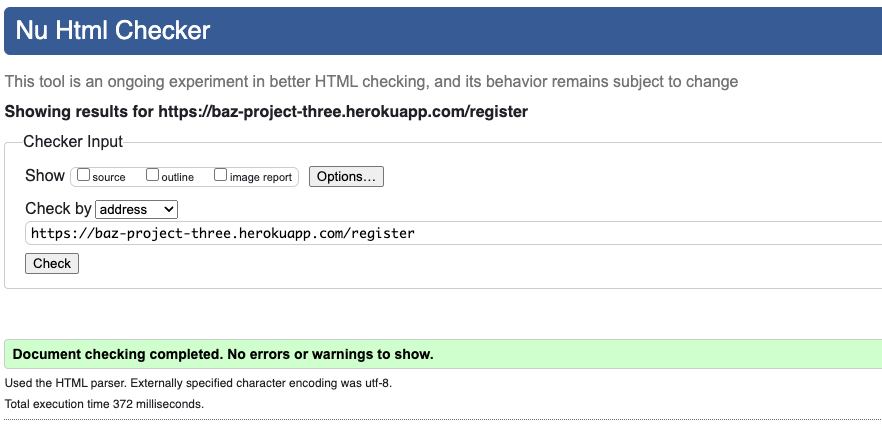

https://blog.teclado.com/protecting-endpoints-in-flask-apps-by-requiring-login/

sercuring routes

## Validation

The W3C Markup Validation Service was used to validate the HTML of the website.
### - - - - Public Pages

Landing Page

Login Page

Register Page

### - - - - Logged In Pages

Chat Page

Edit Activity Page

Edit Comment Page

Map Page

Post Activity Page

Profile Page

Register Group Page

Settings Page

View Activity Page

### - - - - Loading Pages

Landmark JSON Page

Map Link Page

Set Up JSON Page

User JSON Page

### - - - - Error Handling Pages

403, 404, 500 Page

### - - - - Admin Pages

Add Landmark Page

Admin Page

Edit Group Page

Edit Landmark Page

Edit User Page

Groups Page

Landmarks Page

Users Page

