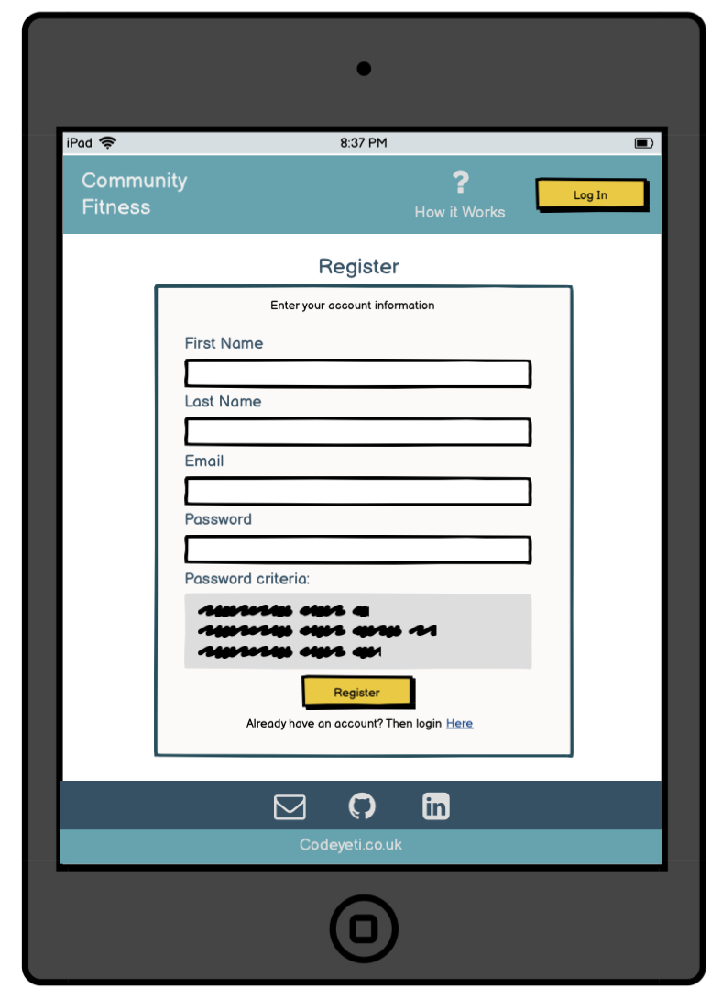

<h1 align="center">Wireframes</h1>

  

The wireframes for this site were produced in Balsamiq (https://balsamiq.com/).
 
Wire frames were created for Desktop and Tablet.

  

## Desktop
---

-   Responsive on all device sizes

<h2 align="center">

</h2>

 

Back to README - [View](README.md)

  

## Tablet
---

-   Responsive on all device sizes

 

<h2 align="center">

</h2>

 

Back to README - [View](README.md)

